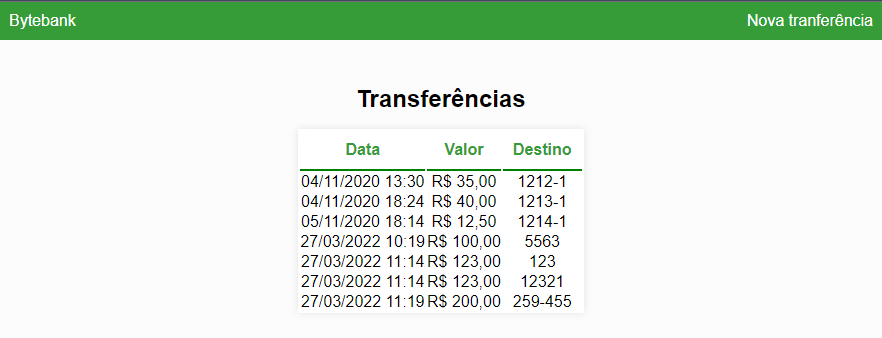

# Bytebank 1

## Português

Bytebank é uma aplicação web que simular serviços bancários simples, como transferências e a exibição de estratos bancários de forma dinâmica.

Esse projet foi feito a partir do primeiro curso da formação em Angular da[Alura Cursos Online](https://www.alura.com.br/).

Esses são os previews do projeto.

Esse projeto foi gerado utilizando o [Angular CLI](https://github.com/angular/angular-cli) versão 10.1.6.

### Servidor de desenvolvimento

Rode `ng serve` para um servidor local. Navegue para `http://localhost:4200/`. O aplicativo recarrega automaticamente com qualquer mudança nos arquivos do projeto.

### Ajuda

Para conseguir mais ajuda no Angular CLI use `ng help` ou de uma olhada no [Angular CLI README](https://github.com/angular/angular-cli/blob/master/README.md).

## English

Bytebank is a web-app that simulates simple banks services, in this case transfers and a bank statement with the last operations.

This project was build with the inicial course of Angular 10 on [Alura Cursos Online](https://www.alura.com.br/).

This is a preview of the project.

This project was generated with [Angular CLI](https://github.com/angular/angular-cli) version 10.1.6.

### Development server

Run `ng serve` for a dev server. Navigate to `http://localhost:4200/`. The app will automatically reload if you change any of the source files.

### Further help

To get more help on the Angular CLI use `ng help` or go check out the [Angular CLI README](https://github.com/angular/angular-cli/blob/master/README.md).
